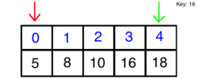

# Binary Search
Linear search is a fantastic implementation of a search algorithm, but it assumes the list is not sorted. Using a binary search algorithm, we can skip half of the list and return what we are looking for much faster.

##### How it Works
Using binary search, we will choose high and low indexes. The algorithm will then grab the element in the middle index and compare it to what we are searching for. If the element is smaller than our key, we discard the half that is larger, and vice versa. Finally, we search through the remaining half of our list until we come across the key. 



##### How it Looks
Here is an example of a binary search algorithm:

```Java
public class BinarySearch extends ConsoleProgram 
{
  public void run() 
  {
    // Create our array of numbers
    int[] listNums = {1, 2, 3, 4, 5, 10, 20};
    
    // Designate a key to search for
    int numKey = 10;
  
    // Assign our high and low indexes
    int low = 0;
    int high = listNums.length-1;
    
    // Start iterating over the array to search for our key
    while(low <= high)
    {
      int mid = (low + high)/2;
      
      if(listNums[mid] == numKey)
      {
        return mid;
      }
      else if(listNums[mid] < number)
      {
        low = mid + 1;
      }
      else
      {
         high = mid - 1;
      }
    }
  }
}
```