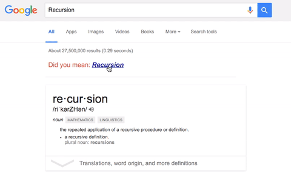

# Advanced: Recursion
Recursion is when you break down a given problem into smaller problems of the same instance. The goal is to break down the problems into smaller forms so that they become easier to solve. 

In computer science, recursion is when a method calls itself to solve a given problem.

## What Recursion Looks Like


(Source: https://prateekvjoshi.com/2013/10/05/understanding-recursion-part-i/)


(Source: https://en.wikipedia.org/wiki/Tower_of_Hanoi)

Recursion is an important part of Computer Science, because it allows us to condense our code into a simple, easy to read, form.

## Parts of a Recursive Method

#### Base Case:
The ***Base Case*** is the terminating case in a recursive problem. This case does not use recursion, because it is the simplest form of the problem. The ***Base Case*** causes the method to terminate. If we don't have a ***Base Case*** the recursive method would continue indefinitely. 

#### Recursive Case:
The ***Recursive Case*** is the step, or set of steps, that reduces all the other cases as the ***Recursive Algorithm*** gets closer to the ***Base Case***.

#### Recursive Algorithm:
The ***Recursive Algorithm*** is a finite set of steps that calls itself with simpler inputs, as the algorithm approaches the ***Base Case***.

## Examples of Recursion
Some common examples of recursive solutions include ***Factorials*** and the ***Fibonacci Sequence***. Other examples of recursive solutions include: Tower of Hanoi, Golden Ratio, Catalan Numbers, and Computer Compound Interest.

### Factorials and Recursion:
One common way to solve for factorials use to use a for loop.
Here is one example:

```Java
private int factorial(int n)
{
    int res = 1;
    for(int i = n; i > 0; i--)
    {
        res *= i;
    }
    return res;
}
```
While this solution definitely works, we can simply it using recursion.
Looking at the formula for factorials:
`n * (n-1) * (n-2) * (n-3)...`

we can see a recurrence relation of:
```
n!:   1 for n = 0,
      (n-1)! * n for n > 0
```

Looking at this from a programming point of view, this means:
``factorial(0); = 1``, and ``factorial(n); = factorial(n-1) * n;``

##### Base Case:
Since ``factorial(0);`` is the simplest form we can achieve, it is our base case. This means we want to keep calling our ``factorial();`` method until the input is equal to ``0``.

##### Recursive Case:
Given that ``factorial(0);`` is our ***Base Case*** we can conclude that ``factorial(n) = factorial(n - 1) * n;`` is our ***Recursive Case***.

Now that we have our ***Base Case*** and ***Recursive Case*** we can construct our recursive method:

```Java
private int factorial(int n)
{
    // Our Base Case
    if(n == 0)
    {
        return 1;
    }
    
    // Our Recursive Case
    return factorial(n - 1) * n;
}
```


### Fibonacci Sequence and Recursion:
The Fibonacci Sequence is achieved by adding up the two previous numbers to get the next number. The sequence looks like:
`1, 1, 2, 3, 5, 8, 13, 21, 34, 55, ...`

The recurrence relation for the Fibonacci Sequence is:
```
F(n) = F(n - 1) + F(n - 2)
```

Given this formula, and looking at the sequence we can conclude that `F(0) = 1` and `F(1) = 1`

From a programming point of view, this means ``fibonacci(0) = 1``, ``fibonacci(1) = 1``, and ``fibonacci(n) = fibonacci(n - 1) + fibonacci(n - 2)``


##### Base Case:
Since ``fibonacci(0) = 1`` and ``fibonacci(1) = 1`` are the simplest forms we can achieve, these are our ***Base Cases***.

##### Recursive Case:
Now that we know our ***Base Cases***, we are left with ``fibonacci(n) = fibonacci(n-1) + fibonacci(n-2)``. This is our ***Recursive Case***.

Now that we have our ***Base Cases*** and ***Recursive Case*** we can construct our recursive method:

```Java
private int fibonacci(int num)
{
    // Our Base Cases
    if(num == 0 || num == 1)
    {
        return 1;
    }
    
    // Our Recursive Case
    return fibonacci(num-1) + fibonacci(num-2);
}
```

## The Humor of Recursion
Sometimes recursion is used as the subject of humor for mathematicians and computer scientists. One of the most famed examples of humorous recursion can be seen by going to Google and searching: "recursion." 


