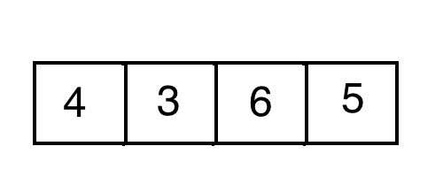

# Insertion Sort
Insertion Sort is another sorting algorithm that we can use to sort arrays. Going back to the statistics package example discussed in the previous chapter, we can use Insertion Sort to sort our array of integers so that we can find the median value. 


##### How it works
As with Selection Sort; Insertion Sort uses loops to iterate over the array. The difference in Insertion Sort is that, as we iterate over the array, we will put each element in its designated position. Where as Selection Sort will search for the smallest element on each iteration.



##### What it looks like

Here is an example of what an Insertion Sort algorithm looks like:

```Java
// Note: In some cases the list may be sorted in reverse order.

public class InsertionSort extends ConsoleProgram
{
  public void run()
  {
    // Create our array of integers to sort
    int[] intsToSort = {1, 5, 6, 3};
    
    // We start at `1` instead of `0`
    // because first value is already sorted
    for(int i = 1; i < intsToSort.length; i++)
    {
      int currNum = intsToSort[i];
      
      // Shift element into designated position
      int currIndex = i-1;
      while(currIndex > -1 && intsToSort[currIndex] > currNum)
      {
        intsToSort[currIndex+1] = intsToSort[currIndex];
        currIndex--;
      }
      intsToSort[currIndex+1] = currNum;
    }
  }
}

```

