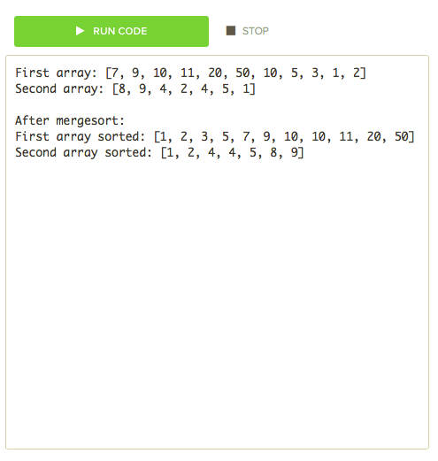

# Mergesort
Mergesort is an extremely efficient sorting algorithm, compared to selection and insertion. Mergesort utilizes recursion to achieve efficient sorting of lists.

### How it works
Mergesort uses what is known as a "Divide and Conquer" strategy. This means mergesort divides the problem into smaller parts until the array length is equal to one. Then it merges together adjacent arrays and sorts them until the whole list is sorted.

Lets see this in action:


Here is another example:


### Mergesort in Java
Here is what mergesort looks like in Java:


```Java
import java.util.Arrays;

public class MyProgram extends ConsoleProgram 
{
    public void run()
    {
        int[] array1 = {7, 9, 10, 11, 20, 50, 10, 5, 3, 1, 2};
        int[] array2 = {8, 9, 4, 2, 4, 5, 1};
        
        System.out.print("First array: ");
        System.out.println(Arrays.toString(array1));
        System.out.print("Second array: ");
        System.out.println(Arrays.toString(array2));
        System.out.println();

        mergeSort(array1);
        mergeSort(array2);

        System.out.println("After mergesort: ");
        System.out.print("First array sorted: ");
        System.out.println(Arrays.toString(array1));
        System.out.print("Second array sorted: ");
        System.out.println(Arrays.toString(array2));
    }
  
    public int[] mergeSort(int[] list)
    {
        if(list.length > 1)
        {
            int firstHalf = list.length/2;
            int secondHalf = list.length - firstHalf;
            int[] listOne = new int[firstHalf];
            int[] listTwo = new int[secondHalf];
      
            System.arraycopy(list, 0, listOne, 0, firstHalf);
            System.arraycopy(list, firstHalf, listTwo, 0, secondHalf);
      
            mergeSort(listOne);
            mergeSort(listTwo);
      
            merge(listOne, listTwo, list);
        }
        return list;
    }
  
    public void merge(int[] listOne, int[] listTwo, int[]finalList)
    {
        int indexOne = 0;
        int indexTwo = 0;
    
        int resultPos = 0;
    
        while(indexOne < listOne.length && indexTwo < listTwo.length)
        {
            if(listOne[indexOne] < listTwo[indexTwo])
            {
                finalList[resultPos] = listOne[indexOne];
                indexOne++;
            }
            else
            {
                finalList[resultPos] = listTwo[indexTwo];
                indexTwo++;
            }
            resultPos++;
        }
        System.arraycopy(listOne, indexOne, finalList, resultPos, listOne.length - indexOne);
        System.arraycopy(listTwo, indexTwo, finalList, resultPos, listTwo.length - indexTwo);
    }
}
```

Here is what this looks like in the editor:




### Extra Notes
It is important to know that if you utilize mergesort you will need to have extra space for temporary storage.

Mergesort is also recursive, meaning it calls upon itself.

In a more advanced setting we can observe that the runtime complexity of mergesort is `O(nlogn)`. This means that mergesort is a linear (n), and the operation occurs in `log(n)` steps.


