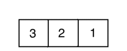

# Selection Sort
Lets say we are working on a statistics package that returns the median value of an array. The problem we run into is that the numbers in the array aren't sorted. First we must sort the numbers in the array from smallest to largest. Using Selection Sort is one way to sort the numbers in this array.


##### How it works

Selection Sort will sort the numbers in our array using loops to iterate over the arrays as we sort one number at a time. Each time the loop iterates we look for the smallest value left in the unsorted chunk and sort it. 



##### How it looks

Here is an example of what a Selection Sort algorithm looks like:

```Java
/* This is a Selection Sort example with an array of 
 * integers. This will iterate over our array, and 
 * look for the smallest values. It will rearrange 
 * our values from smallest to largest
 */  
public class SelectionSort extends ConsoleProgram 
{
  public void run() 
  {
    // Create our array of numbers
    int[] intsToOrder = {10, 3, 6, 4, 5, 1};
    
    // Create minimum index, and temporary value variables
    int minIndex = 0;
    int tmpValue = 0;
    
    // Loop through the number array and set minIndex to i
    for(int i = 0; i < intsToOrder.length - 1; i++)
    {
      minIndex = i;
      // Loop through the array again, and compare each value to 
      // the value at `minIndex`. Set `minIndex` to `j` if it's smaller.
      for(int j = i + 1; j < intsToOrder.length; j++)
      {
        if(intsToOrder[j] < intsToOrder[minIndex])
        {
          minIndex = j;
        }
      }
      
      // Swap the value in spot `i` with the value in
      // `minIndex`
      tmpValue = intsToOrder[minIndex];
      intsToOrder[minIndex] = intsToOrder[i];
      intsToOrder[i] = tmpValue;
    }   
  }
}

```

