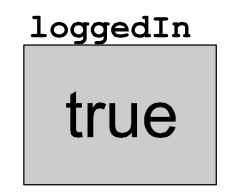

# Booleans
How do we write code that tells us whether a user is logged in to our program? Booleans are the solution to these questions. 

### What are booleans?
A boolean refers to a value that is true or false. Those are the only values of a boolean expression, and these are useful if we want to check if something is true or false.

### Meet George Boole
Let's meet the fellow behind the name, "booleans," George Boole. Mr. Boole was an English-born mathematician, philosopher, and logician. He introduced boolean algebra in *The Mathematical Analysis of Logic* (1847) and *Investigation of the Laws of Thought* (1854). Many consider him to be one of the founders of Computer Science.


### Working with Booleans
How about an example? Let's create a variable and set it equal to true. Then, we'll print the variable. 

We first want to declare the variable, ```loggedIn```, and set it to true or false.
```
boolean loggedIn = false;
```

We can similarly set the variable to true instead:
```
boolean loggedIn = true;
```

You can imagine a boolean variable as a box that can hold only the values true or false. The box below shows the current value of ```loggedIn```:




Notice that we do not need to have quotations around ```true``` or ```false```.

The full example looks like: 
```
// In this program we declare a boolean
// value to represent whether the user
// is logged in, and then print it out.
public class LoggedIn extends ConsoleProgram
{
    public void run()
    {
        boolean loggedIn = false;
        System.out.println("User logged in?: " + loggedIn);
    }
}
 
```
Remember, use booleans if you want to set a variable to true or false!


