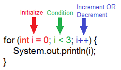

# For Loops

For loops allow us to repeat code a fixed number of times. A basic for loop is structured like this:

```
for (int i = 0; i < COUNT; i++) {
    //Code segment that is executed COUNT times.
}
```

## Breaking Down the For Loop

A for loop can be divided into three major parts. The first part **initializes** the loop variable, the second part tests some **condition**, and the third part **increments** or **decrements** the loop variable. Each part of the for loop is separated by a semicolon (`;`). 

Let's break down the following example into its three major parts:




#### Part 1: Initialize

The first part of a for loop initializes some variable. In the example above, `int i = 0` initially sets the variable `i` equal to `0`.

#### Part 2: Condition

The second part of a for loop tests a condition. If the condition is true, the code within the for loop executes. If the condition is false, the code within the for loop is skipped. In the example above, 
**i < 3** compares the current value of our variable `i` to determine if it is less than `3`. Each time `i` is less than `3`, the value of `i` will be printed to the screen. This happens three times.

#### Part 3: Increment/Decrement

The third part of a for loop changes the variable after each time the loop runs. Remember, `i++` means 1 is added to `i`. It is incremented. Conversely, `i--` means 1 is subtracted from `i`. It is decremented.

#### Putting It All Together

What happens when we run the example for loop? What gets printed to the screen? 

The first part of our for loop, `int i = 0`, initializes our variable. It sets our loop variable `i` equal to `0` Next, the condition part of the loop is evaluated. Is **i < 3**? Since `i` is currently set to `0`, and `0` is indeed less than `3`, the condition **i < 3** is *true*. Thus, the code within the for loop is executed. `0` is printed to the screen. After this, `i` is incremented. `i++` means we add 1 to `i`, so `i` is now set to `1`.

Since `i` is now set to `1`, the condition **i < 3** is re-evaluated. It is still *true*. `1` is now printed to the screen. `i` is incremented again and becomes set to `2`.

The condition **i < 3** is re-evaluated. Since `i` is now set to `2`, our condition is still *true*. `2` is printed to the screen. `i` is incremented again and becomes set to `3`.

Finally, when the condition **i < 3** is re-evaluated, our condition is *false*. 3 is not less than 3, so the code within the for loop is skipped. Nothing else gets printed. The for loop is done.

Thus, our output would be:

```
0
1
2
```

## More Examples

### Countdown

In this countdown example, `i` is initially set to 5. We decrement (or subtract) 1 from `i` on each iteration of the for loop. We print out each value of `i` until it reaches 0.

```
System.out.println("Initiating countdown:");
for(int i = 5; i >= 0; i--){
	System.out.println(i + "...");
}
```
Output:
```
Initiating countdown:
5...
4...
3...
2...
1...
0...
```

### Count by Twos

Instead of incrementing or decrementing `i` by 1, we will increment `i` by adding 2 in this example instead. This allows us to count up by two each time.

```
for(int i = 0; i < = 20; i += 2){
	System.out.println(i);
}
```
Output:
```
0
2
4
6
8
10
12
14
16
18
20
```

### For Loop Sum Program

Here is a program which sums all numbers from 1 to 100. The for loop adds the numbers 1+2+3+4+5+6+.....+98+99+100. Since this program uses global constants, we can easily change the `MIN` and `MAX` values used in our sum without having to touch the for loop at all.

```
// This program adds the numbers from 1
// to 100.
var MIN = 1;
var MAX = 100;

function start(){
	var sum = 0;
	for(var i = MIN; i < = MAX; i++){
		sum += i;
	}
	println("The sum was " + sum);
}
```
Output:
```
The sum was 5050
```


