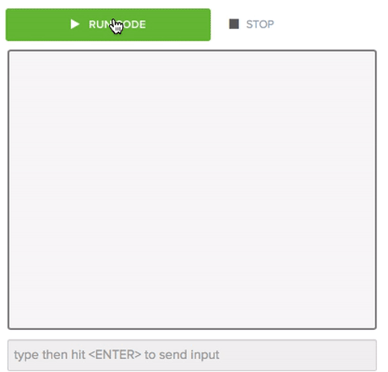

# User Input

Being able to obtain user input creates new opportunities while coding. This allows us to see what the user wants, and take in data to make our programs work for the user.

## Getting User Input

In Java there are four ways we can obtain user input:


## Input of Strings

To read the user's input as a string, we use ``readLine("String prompt")``. This allows us to ask the user for their name, favorite color, or any other text input from the user.

Here is an example of how we would ask the user for their favorite color, and then print it:

```java
// Ask for the input, and store it in the 'favColor' string.
String favColor = readLine("Hello, what is your favorite color? ");
// Then print it.
System.out.println(favColor);
```

## Input of Integers

To read the user's input in an integer format, we would use ``readInt("String prompt")``. This allows us to ask the user for their age, favorite number, or any other whole number. 

Here is an example of how we would ask the user for their age, and then print it:

```java
// Ask for the input, and store it in the 'age' integer.
int age = readInt("Hello, how old are you? ");
// Then print it.
System.out.println(age);
```

## Input of Doubles

To read the user's input as a double, we use ``readDouble("String prompt")``. This allows us to ask the user how many miles they have traveled, how much an item costs, or any other numerical value that has a decimal.

Here is an example of how we would ask the user for how many miles they have traveled, and then print the input:

```java
// Ask for the input, and store it in the 'miles' double.
double miles = readDouble("How many miles have you traveled? ");
// Then print it.
System.out.println(miles);
```

## Input of Booleans

To read the user's input as a boolean, we use ``readBoolean("String prompt")``. This allows us to ask the user any true or false question.

Here is an example of how we would ask the user if they are a astronaut, and then print their answer:

```java
// Ask for the input, and store it in the 'isAstronaut' boolean.
boolean isAstronaut = readBoolean("Hello, are you an astronaut? ");
// Then print it.
System.out.println(isAstronaut);
```

## User Input Applications

Now that we have seen a some examples of how to get user input, lets look at some applications.

Lets say we are writing a piece of code in which we want to ask the user for their name, age, and if they own a pet. In this case we will ask the user each question, one at a time, and store the answers in their own variables. After we get the user input we will print the variables. Here is what our code will look like:

```Java
public class UserInput extends ConsoleProgram
{
    public void run()
    {
        String name = readLine("What is your name? ");
        int age = readInt("How old are you? ");
        boolean hasPet = readBoolean("Do you own a pet? ");
        
        System.out.println("");
        System.out.println("Your name is " + name);
        System.out.println("You are " + age + " years old.");
        System.out.println("You own a pet: " + hasPet);
    }
}
```

Here is what the user prompts will look like, once the code executes:


# Practice Questions


