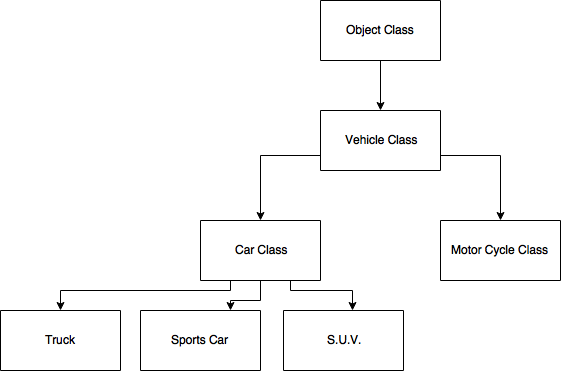

# Inheritance
<hr>

***Inheritance*** is when we have two classes that share functionality. You use ***inheritance*** when you want to create a new class, but utilize existing code from another class. In this case, you derive your new class from the existing class. By doing this, you can utilize methods from the existing class without having to rewrite code.

### Class Hierarchy
<hr>
***Class hierarchy*** is the inheritance relationship between your classes. ***Class hierarchy*** is also known as an inheritance tree. It is important to know that the ***root class*** in our hierarchy is the ***Object Class***. The ***Object Class*** contains many useful methods, such as: `clone()`, `equals()`, `toString()`, `finalize()`, and a few others. The further away from the ***root class*** we go the more exclusive the class behavior is.

Here is an example of an inheritance tree:


As you can see, we start off with our ***root class***, move to *Vehicle Class* and from there we get more defined as we go down the tree. Whenever we pass a method through our class it will travel up the inheritance tree until a suitable definition is found. Lets say we start in the *Truck* class, and call `toString()`. The `toString()` message will be sent up the tree until it gets to the *Object Class*. Once it gets to the *Object Class* a `toString()` method is found and utilized.

### Subclass and Superclass
<hr>
The ***Subclass*** is the class the extends another class, or inherits from another class.

The ***Superclass*** is the class being utilized by the ***subclass***.

In order to show that a class relates to another, we use the **extends** keyword. Here is an example of a class that extends the **ConsoleProgram** class:

```Java
public class Output extends ConsoleProgram {
}
```
In this example `Output` is our ***subclass***, and `ConsoleProgram` is the ***superclass***.

### Example of Inheritance
<hr>