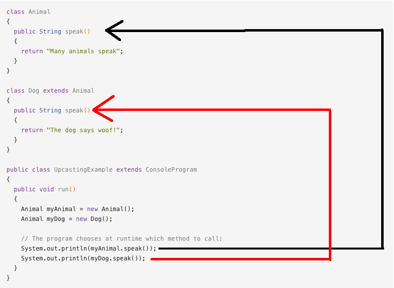
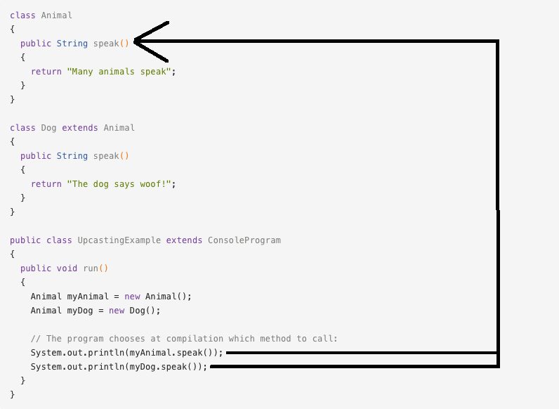

# Polymorphism
<hr>
***Polymorphism*** is one of the most important concepts in Object Oriented Programming.
<br>
<br>
***Polymorphism*** is the capability of a single object to take on multiple forms. ***Polymorphism*** can also be explained as the ability to perform a single action, in many ways, across multiple objects. This means we can use the same method across different objects, using different implementations. 

### Concepts of Polymorphism
<hr>
There are several concepts of ***polymorphism*** that are crucial to understand. These include: 

- **Method Overriding: ** Allows us to call the correct implementation of a method across multiple objects that share the same superclass.

- **Upcasting: ** Occurs when the reference variable of a superclass points to the object of the subclass. This allows us to go from a low level class type to a higher level one.
<br>
(ex: `Animal fox = new Fox();`, `Animal dog = new Dog();`)

- **Downcasting: ** Occurs when the reference variable of a subclass points to an object of the superclass type. This will manually convert the object type to that of the subclass.
<br>
(ex: `Animal animal = new Fox();` `Fox castedFox = (Fox) animal`)

- **Dynamic Binding: ** Is the concept where the proper method implementation is chosen at run-time, and not compilation.

- **Static Binding: ** Is the concept where the proper method implementation is chosen at compilation, and not run-time.


### Method Overriding
<hr>
***Method Overriding*** allows us to use the same method across multiple objects, with differing implementations. Lets take a look at an example of this concept:

```Java
public abstract class Animal
{
  public abstract String speak();
}

public class Dog extends Animal
{
  public String speak()
  {
    return "The dog says woof!";
  }
}

public class Fox extends Animal
{
  public String speak()
  {
    return "What does the fox say?";
  }
}

public class UpcastingExample extends ConsoleProgram
{
  public void run()
  {
    Animal myFox = new Fox();
    Animal myDog = new Dog();
    
    /* Polymorphism here is seen as the correct implementaiton of `speak()`
     * being chosen, regardless of the object type. */
     
    System.out.println(myFox.speak()); // Will print `What does the fox say?`
    System.out.println(myDog.speak()); // Will print `The dog says woof!`
  }
}
```

### Upcasting:
<hr>
***Upcasting*** refers to taking an object of a lower level class type and referencing it to a class of a higher level. Lets look at an example of this:

```Java
public abstract class Animal
{
  public abstract String speak();
}

public class Dog extends Animal
{
  public String speak()
  {
    return "The dog says woof!";
  }
}

public class Fox extends Animal
{
  public String speak()
  {
    return "What does the fox say?";
  }
}

public class UpcastingExample extends ConsoleProgram
{
  public void run()
  {
    Animal myDog = new Dog(); // Upcasting
    Animal myFox = new Fox(); // Upcasting
  
    System.out.println(myDog.speak()); // Will print `The dog says woof!`
    System.out.println(myFox.speak()); // Will print `What does the fox say?`
  }
}
```
### Downcasting
<hr>
***Downcasting*** is conversion of a reference variable's type to that of the subclass. A difference in ***downcasting***, as compared to ***upcasting***, is that you must manually downcast. Lets look at an example of this:

```Java
public abstract class Animal
{
  public abstract String speak();
}

public class Dog extends Animal
{
  public String speak()
  {
    return "The dog says woof!";
  }
}

public class Fox extends Animal
{
  public String speak()
  {
    return "What does the fox say?";
  }
}

public class UpcastingExample extends ConsoleProgram
{
  public void run()
  {
    // Upcasting is done automatically
    Animal myDog = new Dog(); // Upcasting
    Animal myFox = new Fox(); // Upcasting
  
    // Downcasting must be done manually
    Dog yourDog = (Dog) myDog; // Downcasting
    Fox yourFox = (Fox) myFox; // Downcasting
  
    System.out.println(yourDog.speak()); // Will print `The dog says woof!`
    System.out.println(yourFox.speak()); // Will print `What does the fox say?`
  }
}
```

### Dynamic Binding
<hr>
***Dynamic Binding*** is an important concept to ***runtime polymorphism***. It is the concept of the proper method implementation being chosen at run-time. Lets look at an example: 



### Static Binding
<hr>
***Static Binding*** is another important concept to ***polymorphism***. ***Static binding*** chooses the proper method implementation at compilation, and not run-time. ***Static binding*** only checks the type of the reference variable and not where it is pointing. Lets look at an example of this concept:



### Polymorphic Arrays
<hr>
***Polymorphic Arrays*** allow us to store an array of objects with differing types that share the same superclass. Lets see this in action:

```Java
public abstract class Animal
{
  public abstract String speak();
}

public class Dog extends Animal
{
  public String speak()
  {
    return "The dog says woof!";
  }
}

public class Fox extends Animal
{
  public String speak()
  {
    return "What does the fox say?";
  }
}

public class Cow extends Animal
{
  public String speak()
  {
    return "The cow goes moo!";
  }
}

public class AnimalArrays extends ConsoleProgram
{
  public void run()
  {
    // Create the array and set its size to `3`
    Animal[] animalArray = new Animal[3];
    
    // Set each object in the array
    animalArray[0] = new Dog();
    animalArray[1] = new Fox();
    animalArray[2] = new Cow();
    
    // Print out the array
    for(int i = 0; i < animalArray.length; i++)
    {
      // Will print out the various `speak()` methods for each animal.
      System.out.println(animalArray[i].speak());
    }
  }
}
```


