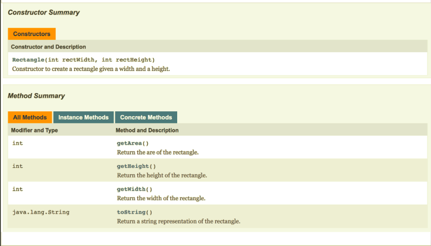

# Using a Class as a Client

In Java, we can think of everything as a class. If we want to write an application to model a grade book, ***Grade Book*** is a class. The same can be thought of with any program you code in Java.

Since we can think of everything as a class in Java, we can bundle these classes and use as many as we'd like. You don't necessarily need to know how the classes you use work, because you can use classes built by someone else.

Whenever we use a class it is a ***client of the class***.

### Reading Documentation

Documentation is a great resource to use to see how a class works. As long as you can read the documentation, you don't need to know how the class works.

Here is an example of the documentation for the String Class:

(http://docs.oracle.com/javase/7/docs/api/java/lang/String.html)

The documentation for a class tells us how to use the class constructor, and various methods that the class provides. 

Here is another example of documentation:

This documentation is for the Rectangle Class that we've worked with in previous exercises.