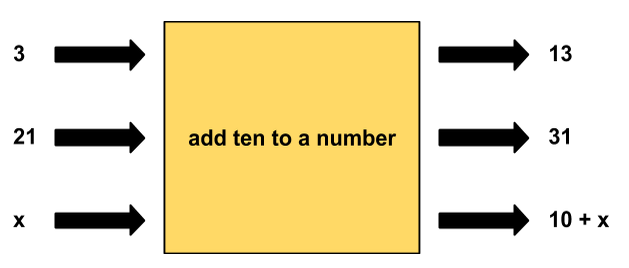

# Methods and Parameters

Writing methods allows us to break our code into well-organized and reusable parts. But sometimes we may want to reuse a method with a slight change.

## Repetitive Actions
Take a look at the following code:

```
int x = 3;
int addTenToX = 10 + x;
System.out.println(addTenToX);

int y = 21;
int addTenToY = 10 + y;
System.out.println(addTenToY);
```

Notice that the code contains some repetition. The process of adding 10 to a variable is the same whether we're
adding `10 + 3` or `10 + 21`. In each case, we're adding 10.

## Parameters
Recall that methods are like blocks of code that do a particular thing. We can write a method that prints out
"hello" when called, or a method that draws a circle. But what if we want to create a method to add ten
to a number? We can sketch out the method like so:



We would expect an `addTen` method to add 10 to any number it is given. If we give it 3, the method will give us 13.
Were we to give it 32, it would give us 42. This pattern can be generalized even more: if we give the method
any number `x`, it will give us `x + 10` in return. The action that the `addTen` method takes is the same every time
-- it adds 10 -- the only thing that changes is the number we give to the method. The number that we pass
to the method is called a **parameter**.


## Defining a method with Parameters
Let's write the `addTen` method in code:

```
public void addTen(int x)
{
  int xPlusTen = x + 10;
  System.out.println(xPlusTen);
}
```
Notice that there is an `x` that is being taken in and used by the method. This is the parameter. Its value will 
be whatever the user decides to "pass" to the method. Also note that the `x` parameter can be used like a
regular variable in the body of the method.

## Calling a Method with Parameters
Now that the `addTen` method is defined, it's time to call the method. Let's first add ten to the number 5:

```
addTen(5);
```
This will result in `15` being printed to the console.

This works with variables as well. We can create a variable `y` that stores a number, then pass `y` to the 
`addTen` method:

```
int y = 115;
addTen(y);
```

The variable 115 is passed as an **argument** to the `addTen` method. The method accepts 115 as the **parameter**, adds 10 to it, and then prints `125` to the console.

## Multiple Parameters
It's often helpful to write methods that can take in more than one parameter. For example, if we were to write
a generic `add` method, we would want to be able to input two numbers. To include more than one parameter, you
can simply write more than one parameter, separated by a comma. The code below takes in two numbers, represented
by `x` and `y`, and adds them:

```
public void add(int x, int y)
{
  int sum = x + y;
  System.out.println(sum);
}
```
We call the method in a similar manner. If we give the function the following calls:
```
add(10, 90);
add(635, 1000);
int first = 72;
int second = 14;
add(first, second);
```
then the program will print the following to the console:
```
100
1635
86
```

## Why Use Parameters?
Using parameters allows us to write code that is flexible and reusable. Writing a method is like telling the
program to do something (add two numbers or draw a rectangle on the canvas). Parameters are like giving that
method specific instructions ("I want to add 3 and 7" or "I want my greeting message to say their name and my name").

Functions can also take in multiple parameters. If you wanted to print several greetings, you'd likely want them
to contain different text depending on the person receiving the greeting. If each of these pieces of information was hard-coded into the method, you would need a separate method for each greeting!

Using parameters allows you to write one `printMessage` method that can be used to send many greeting messages:

```
public void printMessage(String to, String from, String salutation, String message)
{
  System.out.println("-------------");
  System.out.println(salutation + " " + to + ",");
  System.out.println(message);
  System.out.println("Best regards,");
  System.out.println(from);
  System.out.println("-------------");
}
```
If Karel wants to send a birthday message to Bill Gates and a Halloween card to Steve Wozniak, Karel could write:

```
printMessage("Bill Gates", "Karel", "Howdy", "Wishing you a happy birthday!");

String halloweenMessage = "Hope you have a spooky Halloween!";
printMessage("Steve Wozniak", "Karel", "Hi", halloweenMessage);

```

This would print two letters to the console:

```
-------------
Howdy Bill Gates,
Wishing you a happy birthday!
Best regards,
Karel
-------------
-------------
Hi Steve Wozniak,
Hope you have a spooky Halloween!
Best regards,
Karel
-------------
```

## An Important Note!
It's very important to pass arguments to methods in the proper order. Using the `printMessage` example above, you
may know that Karel is the name of the person sending the message and that you want it to start with "Howdy", but the computer does not know this information. The way that the computer finds out which argument goes to which parameter is by the order in which your code passes the arguments into the method. For example, if you wrote:

```
printGreeting("Howdy", "Karel", "Wishing you a happy birthday!", "Bill Gates");
```

you would end up with a mixed-up message:

```
-------------
Wishing you a happy birthday! Howdy,
Bill Gates
Best regards,
Karel
-------------
```

As you can see, order matters when you are using parameters.
