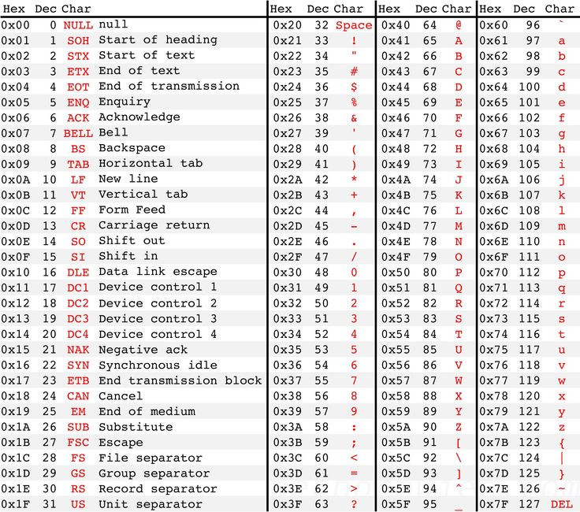

# Strings and Characters
Let's review some key differences between Strings and characters:

| Strings | characters |
| -- | -- |
| Type: String | Type: char |
| Object | primitive |
| Compare using the `.equals()` method| Compare using `==` |
| Surrounded by double quotes (Example: "hello") | Surrounded by single quotes (Example: 'a') |
| Sequence of characters (Example: "hello") | A single character (Example: 'a')|

Here is an example of declaring a String in Java:
```
String website = "CodeHS";
```
And here is an example of declaring a character in Java:
```
char letter = 'b';
```

Let's break apart these two examples into their individual components:


Highlighted in blue is the type. On the left, we have the type for Strings, `String`. On the right, we have the type for characters, `char`. Highlighted in orange is the name of our variables. We can name them whatever we want, but our names should follow proper naming conventions and make sense. Highlighted in red is the value. This is the actual String and character we are assigning to our variable.

## Characters are Numbers!

Computers prefer working with numbers rather than letters. Thus, every character is actually a unique number behind the scenes. The table below lists each character's assigned number. This table is known as the **ASCII** (***A***merican ***S***tandard ***C***ode for ***I***nformation ***I***nterchange) **table**:



The table has three columns. The first column, `Hex`, gives us each character as a **hexadecimal number**. Hexadecimal numbers are just another way for us to represent each character, but for now, we will ignore this column. It isn't important to us right now. The second column, `Dec`, gives us each character as a **decimal number**. Decimal numbers are the standard numbers that we are all used to working with (0, 1, 2, 3, 4, etc.). The third column, `Char`, lists each of the corresponding characters.

It is important to remember that lowercase and capital letters are assigned different numbers. For example, the capitalized character 'A' is the number 65 whereas the lowercase character 'a' is the number 97. You will also notice that there are a lot of special characters like "NULL" (number 0), "TAB" (number 9), and "CAN" (number 24). Most of these special characters are abbreviated, so they are spelled out more clearly to the right. For example, "CAN" stands for "Cancel".


