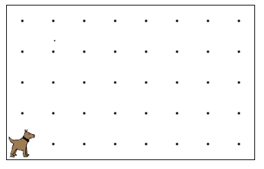

# For Loops

We've seen how to give Karel instructions, but so far we've given each command one at a time.  But what if we want Karel to move 40 times?  Or what if we want Karel to put down 135 balls in one spot?  Do we really have to type ```putBall()``` 135 times?  The good news is, no we don't!

### Why For Loops?
For loops let us type a series of commands only  once, then let the program tell Karel to do it multiple times. It is important to note that for loops are used when we want a fixed number of repetitions. For example, we could use a for loop if we want to move 10 spaces or put down 150 balls.  In both of these cases, we have a fixed number of times we want a specific set of instructions to be executed.

### Using For Loops
The syntax of a for loop is as follows:

```
for(int i = 0; i < count; i++)
{
    //code you want repeated
}
```

This piece of code says the variable `i` will start with the value 0.  Then, as long as `i < count`, the code you want repeated will execute.  The `i++` part specifies how `i` will change after every iteration.  `i++` means add one to the value of `i` after each time the program does everything between the curly braces.  The flow chart below shows the flow of execution in a for loop.


### Examples
Let's make Karel put down 5 balls.  In this case, `count` will be 5, because we want something to happen 5 times.  The code inside of the for loop will be `putBall()` because that's what we want to happen 5 times.  The for loop looks like this:

```
for(int i = 0; i < 5; i++){
    putBall();
}
```

Let's look at another example.  This time, we want Karel to put a ball down on every other space. This means that every iteration, Karel will have to move, put down a ball, then move again. The start world looks like this:



The world should look like this when Karel is finished putting down balls: 


We know that this world has 9 avenues. Karel will move across 2 of them every iteration.

### Test Yourself!!

---


<p>Try out these questions to test your understanding of for loops </p>
<pre> Fill in the blanks:
        for( ____ i = 0; i < 5; i++)
        {
            putBall();
        }
</pre>
- ( ) var
- ( ) count
- (x) int
- ( ) Nothing should go in the blank

> Not quite.  `var` is used in JavaScript, but not Java

> Nope. `count` is not a variable type. `i` has to be declared as a variable.  Note this also means that `i` could have any variable type, as long as you can add variables of that type.

> Yes! Typically `i` is declared as an int.

> Remember that `i` is a variable and must be declared with a type.  


---


