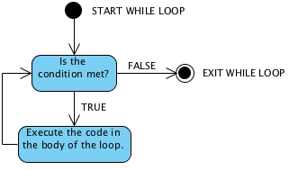
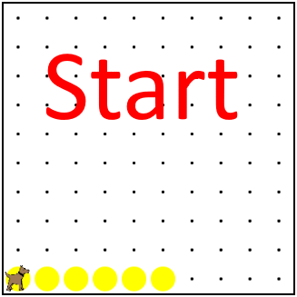

# While Loops in Karel

Lets say Karel is standing on one side of the world, and we want to move to the next side. Up to this point, the best way would be to write a for loop that repeats the ```move();``` command a set number of times. What if we don't know the size of Karel's world? In this case we would use a while loop, which will execute a command while a condition is true. 

## Basics of While Loops

While loops, unlike for loops, execute the target statement as long as the given condition is true. 

A while loop is usually formatted like:
```
while(condition)
{
    // code to execute
}
```

It is important to know that a while loop will ***only*** repeat the target statement until the condition is no longer true. Consider the following diagram:



## Examples of While Loops

Consider the following situation:

 - While a vehicle's engine is on, it will use gas. 
 - When the vehicle's engine is off, it will no longer use gas.
 

In this case the vehicle's engine represents the condition of our while loop. The use of gas represents our target statement that will only execute when the condition is met. Your code for this situation should look like:
``` 
while(engineOn())
{
    useGas();
}
```
Here is another example of a while loop, as seen in Karel's world:

 - While a ball is present in Karel's current position, move one space.
 - When Karel lands on a position that does not contain a ball, don't move.


In this situation Karel will only move when a ball is in Karel's current position. As soon as Karel lands in a position that does not contain a ball the loop will exit, and Karel will stop moving. The code for this situation should look like:
```
while(ballsPresent())
{
    move();
}
```

<!-- 
## While Loop Practice Exercises


**1)** Consider a world where we want Karel to move to a position without a ball. 



---

<p> Which while loop is correct for this situation? </p>
- [x] ``` while(ballsPresent()) { move(); }```
- [ ] ``` while(ballPresent) { move(); } ```
- [ ] ``` if(ballsPresent()) { move(); } ```
- [ ] ``` for(ballsPresent()) { move(); } ```
 
> This is the correct answer!

> Very close! Double check the conditional -.. It should have parenthesis ```()``` at the end.

> Super close! An if statement will only execute the step once, and Karel will only move once. 

> Almost! A for loop wont work for this exercise, because we don't know how large the world is. The parameters of the for loop are also incorrect.

---

**2)** Consider a world where Karel starts facing a random direction.


---

<p> What piece of code will make Karel turn until Karel is facing North? </p>
- [ ] ``` while(facingNorth()) { turnLeft(); }```
- [x] ``` while(notFacingNorth()) { turnLeft(); } ```
- [ ] ``` if(notFacingNorth()) { faceNorth(); } ```
- [ ] ``` for(var i = 0; i < 3; i++) { turnLeft(); } ```
 
> Very close! Double check the condition in the loop. Remember, we want to turn when Karel is not facing North.

> This is the correct answer! Nice job!

> Super close! An if statement will only execute the step once, and Karel will only turn once. 

> Almost! A for loop wont work for this exercise, because we don't know which direction Karel is starting in.

---
-->
